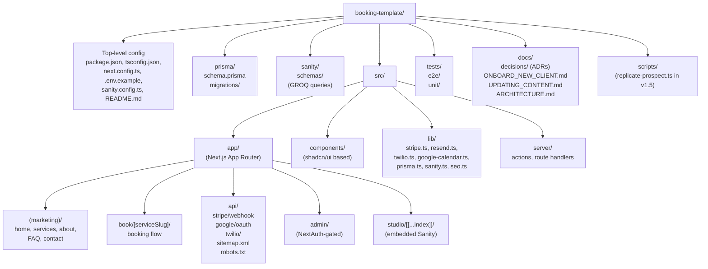
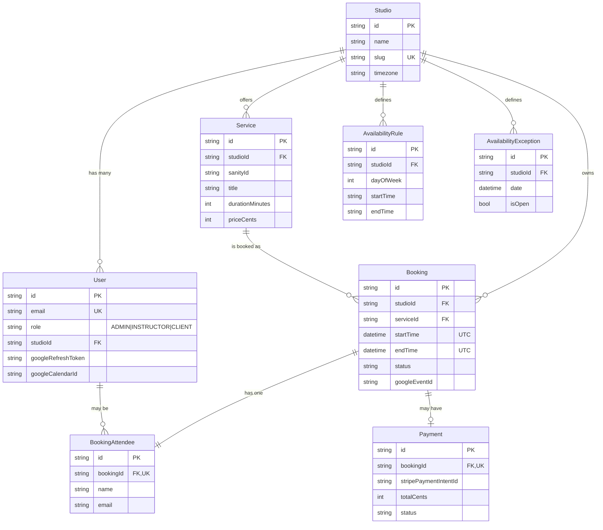
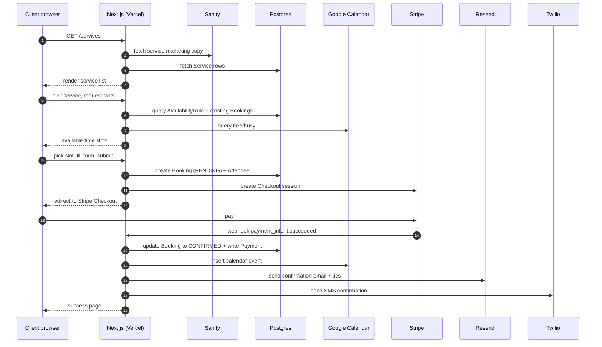

# Architecture

The high-level picture for booking-template. Diagrams use Mermaid.

## High-level architecture

```mermaid
graph LR
    subgraph Browser
        Visitor[Visitor]
        Admin[Admin / Instructor]
        Editor[Content Editor]
    end

    subgraph Vercel
        NextApp[Next.js App<br/>Marketing + Booking + Admin]
        Studio[Sanity Studio<br/>at /studio]
    end

    subgraph "External SaaS"
        Neon[Neon<br/>Postgres]
        SanityCloud[Sanity Content Lake]
        Stripe[Stripe<br/>Checkout + Webhooks]
        Resend[Resend<br/>Email + .ics]
        Twilio[Twilio<br/>SMS]
        GCal[Google Calendar API]
        GPlaces[Google Places API<br/>v1.5]
    end

    Visitor --> NextApp
    Admin --> NextApp
    Editor --> Studio
    NextApp --> Neon
    NextApp --> SanityCloud
    NextApp --> Stripe
    NextApp --> Resend
    NextApp --> Twilio
    NextApp --> GCal
    NextApp -.v1.5.-> GPlaces
    Studio --> SanityCloud
```

## Repo structure



## Database (v1 schema, ER diagram)

See `prisma/schema.prisma` for the canonical Prisma source. Diagram:



When a multi-instructor / dance client lands, additive Prisma migrations bring in `BookingInstructor`, `WaitlistEntry`, `RoleType`, and the `splits` JSON on Payment. The full v2 schema is preserved at `booking-flow-pitches/templates/v2-future/schema-full.prisma`.

## Booking happy path



## Where decisions live

ADRs (Architecture Decision Records) capture *why* in `docs/decisions/`. Numbered, immutable. To change a decision, write a new ADR that supersedes the old one rather than editing in place.

## Companion docs

This is a code repo. The companion docs repo at `github.com/JoaquimPacer/booking-flow-pitches` holds:
- v1 spec, long-term vision, and templates
- Per-client briefs, plans, session summaries
- Cross-AI handoff notes
