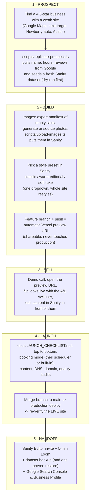
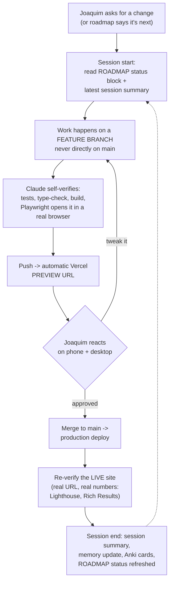

# Client workflow (the repeatable motion)

The end-to-end pipeline from "found a business on Google" to a live, handed-off site. This is the story Joaquim narrates to a prospect, and the checklist of which tool does which job. Details live in the linked docs; this page is the map.

## What each stage means (plain language)

1. **Prospect.** The replicate script does the boring data entry: it asks Google's Places API (the same database behind Google Maps) for the business's name, address, hours, and best reviews, and writes them into a fresh Sanity content workspace. A near-real site exists before any phone call.
2. **Build.** Sanity holds every word and image; the style preset is one dropdown that swaps the whole design system (colors, type, spacing) without touching code. The Vercel preview URL is a private copy of the site on the real infrastructure: safe to share, impossible to break production from.
3. **Sell.** The demo IS the product: flipping design presets and editing text live shows the client exactly what owning the site feels like.
4. **Launch.** One checklist, top to bottom. DNS (the internet's phone book entry pointing their domain at our server) is usually the only step touching anything the client already owns.
5. **Handoff.** The client edits everything themselves in Sanity from day one; Search Console starts collecting data on how Google sees the site from day one.

## The development loop (how any single change happens)

The map above is the business motion. This is the inner loop that runs every time Joaquim asks for a change, from a one-line copy tweak to a redesign. It is the answer to "what is our workflow?" and it needs no extra tooling (no n8n, no separate automation server): the loop IS the workflow, and each box names the artifact that proves it happened.

Why each guardrail exists, in one line each:

- **Branch, not main:** main is what production serves; a branch can be deleted like it never happened. Reversibility is Rule C2, not an aspiration.
- **Self-verify before showing Joaquim:** the artifact gets tested (the reachout tool runs 128 assertions), type-checked, built, and actually opened in a browser before a human spends attention on it.
- **Preview URL before production:** clients and Joaquim react to the real thing on real infrastructure, with zero risk to the live site.
- **Re-verify after production:** "the deploy succeeded" and "the site is right" are different claims; only reading the live site proves the second one.
- **Session summary + memory at the end:** that is how the next session (or a different AI) picks up without re-explaining anything. The summaries folder is the project's long-term memory; `MEMORY.md` is the working memory.

Related: `docs/ROADMAP.md` (phases + status block), `docs/LAUNCH_CHECKLIST.md` (stage 4 in detail), `docs/decisions/` (why things are built this way), `docs/REPO-TOUR.md` (what each folder is for).
