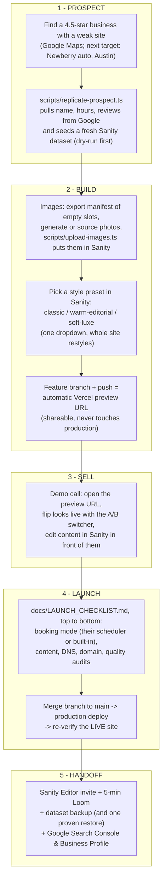

# Client workflow (the repeatable motion)

The end-to-end pipeline from "found a business on Google" to a live, handed-off site. This is the story Joaquim narrates to a prospect, and the checklist of which tool does which job. Details live in the linked docs; this page is the map.

## What each stage means (plain language)

1. **Prospect.** The replicate script does the boring data entry: it asks Google's Places API (the same database behind Google Maps) for the business's name, address, hours, and best reviews, and writes them into a fresh Sanity content workspace. A near-real site exists before any phone call.
2. **Build.** Sanity holds every word and image; the style preset is one dropdown that swaps the whole design system (colors, type, spacing) without touching code. The Vercel preview URL is a private copy of the site on the real infrastructure: safe to share, impossible to break production from.
3. **Sell.** The demo IS the product: flipping design presets and editing text live shows the client exactly what owning the site feels like.
4. **Launch.** One checklist, top to bottom. DNS (the internet's phone book entry pointing their domain at our server) is usually the only step touching anything the client already owns.
5. **Handoff.** The client edits everything themselves in Sanity from day one; Search Console starts collecting data on how Google sees the site from day one.

Related: `docs/ROADMAP.md` (phases + status block), `docs/LAUNCH_CHECKLIST.md` (stage 4 in detail), `docs/decisions/` (why things are built this way).
