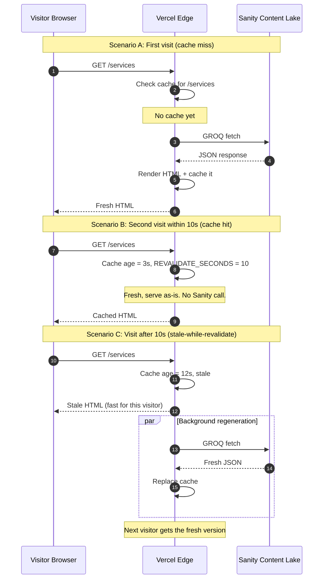

# How content flows: Sanity, Vercel, and the ISR cache

The mental model for how an edit in Sanity Studio becomes visible on the live site.

## Default behavior (ISR with revalidate = 10 seconds)

**Key insight:** every visitor after the cache expires sees stale content for one request. The "background regeneration" updates the cache so the *next* visitor sees fresh content. This pattern is called "stale-while-revalidate."

Tradeoffs:

- **Lower `REVALIDATE_SECONDS`** = fresher content, more Sanity API calls.
- **Higher `REVALIDATE_SECONDS`** = fewer API calls, slower content updates.
- **0 seconds** = no caching, every visitor triggers a Sanity call. Slow, expensive.
- **`false`** = cache forever, only refresh on rebuild. Static-site behavior.

Edit `src/lib/cache.ts` to retune.

## On-demand revalidation (instant updates)

For instant content updates without waiting for the cache window, the production-grade pattern is a webhook from Sanity to a Next.js API route.

What this needs to ship:

1. A Sanity webhook configured in `sanity.io/manage` to fire on document publish.
2. A new Next.js API route at `/api/revalidate` that:
   - Verifies the webhook signature (so randos can't bust your cache).
   - Calls `revalidatePath()` or `revalidateTag()` for the affected URL(s).
3. A secret token shared between Sanity and Vercel (env var).

Not built yet. Adding this is a 30-minute task whenever instant content updates become a priority. For the demo phase, 10-second ISR is comfortable.

## What about local dev (`npm run dev`)?

In dev mode, Next.js does NOT strictly respect `revalidate`. Each request often refetches. So local changes show up on refresh.

If they don't, restart the dev server (`Ctrl+C`, then `npm run dev`) to clear any in-process cache.

## Order of fallback behavior

When a query fails (Sanity down, network error, etc.):

1. **First miss** = the page renders an error (until the next try succeeds).
2. **Stale cache available** = Vercel serves the stale version while retrying in the background.
3. **No cache and no Sanity** = the page renders with `null`-checked optional content. Header/footer should still show defaults from code.

This means the site degrades gracefully if Sanity has a brief outage.

## See also

- `src/lib/cache.ts` — the single number that controls revalidation timing
- `src/lib/sanity-queries.ts` — GROQ queries, each carrying `{ next: { revalidate } }`
- `src/app/*/page.tsx` — page-level `export const revalidate` (must match or exceed the per-fetch value)
- `docs/ARCHITECTURE.md` — the bigger picture diagram of all services
