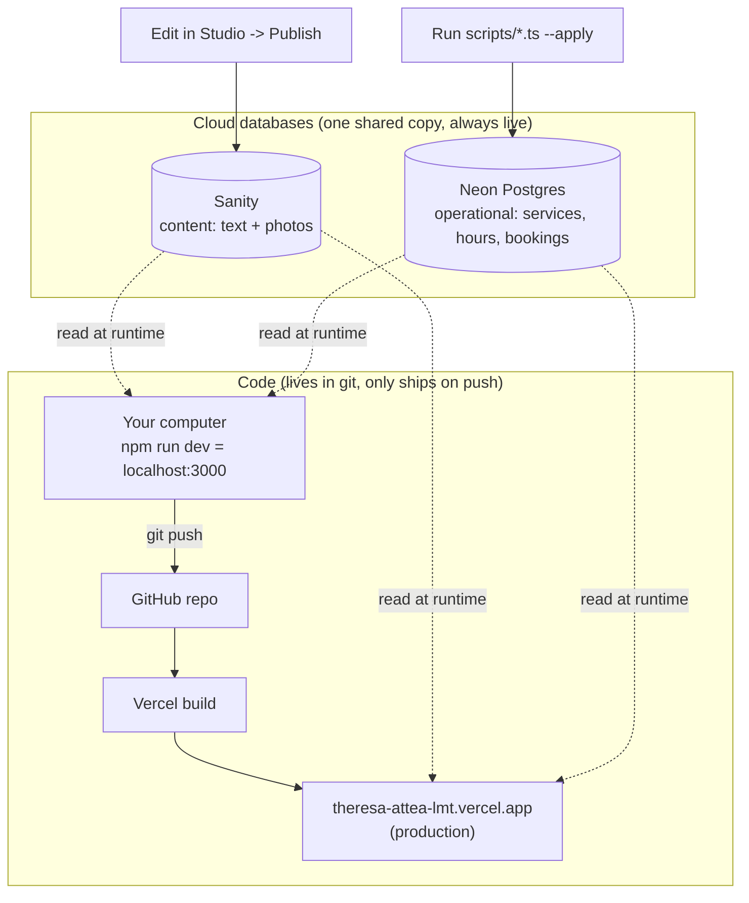
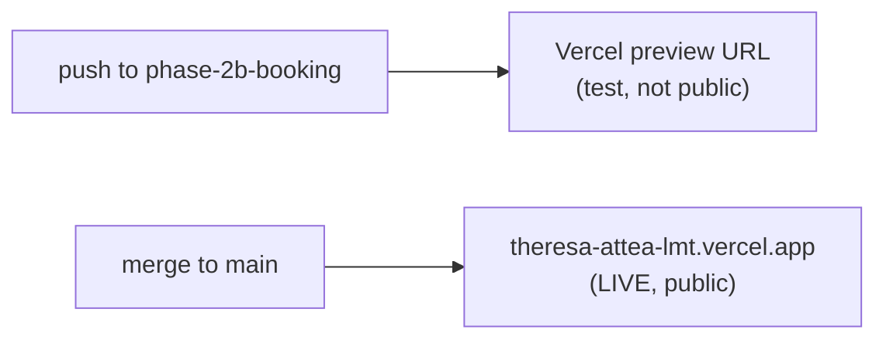

# Making changes: what's local, what's production, and how things ship

This is the operator's mental model (for Joaquim, not the end client). It answers:
"I changed something. Where does it show up, and how do I get it live?"

## The one idea that clears up the confusion

There are **three different things** you can change, and they reach the live site
**three different ways**. Mixing them up is what makes it feel confusing.

| You change... | Examples | Where it lives | How it goes live | Need `git push`? |
| --- | --- | --- | --- | --- |
| **Content** | Text, photos, hero, prices/hours shown, FAQ | Sanity cloud | Click **Publish** in Studio | No |
| **Operational data** | The booking engine's services, weekly hours, bookings | Neon (Postgres) cloud | Run a `--apply` script | No |
| **Code** | Page layout, the booking logic, new features, styling | GitHub repo | `git push` -> Vercel builds | **Yes** |

**The key insight:** Content and data live in **one shared cloud copy**. There is no
"local content" vs "production content." When you edit in Studio (whether you opened
it at `localhost:3000/studio` or `theresa-attea-lmt.vercel.app/studio`), you are
editing the **same** cloud database that production reads. That's why content edits
are live almost instantly and never need a push.

Only **code** has a local-vs-production split. `npm run dev` runs *your local copy of
the code* on your computer, while reading the same live content + data. Production
runs *the code that's been pushed and built*.

## Why the Studio says "Booking Template" and Sanity says "no studios deployed"

Two things that look wrong but aren't:

1. **The Studio title.** It used to read "Booking Template" because that label was
   hardcoded. It now reads the business name when you set `NEXT_PUBLIC_STUDIO_TITLE`
   in `.env` (e.g. `Theresa Attea, LMT`). Either way, the studio connects to whatever
   `NEXT_PUBLIC_SANITY_PROJECT_ID` points at (Theresa = `7vrjehyn`). The label is
   cosmetic; the project ID is what actually decides whose content you're editing.

2. **"There are no studios deployed for this project yet"** on sanity.io/manage. That
   message is about *Sanity-hosted* studios (the optional `xxx.sanity.studio` URL).
   We don't use those. Our Studio is **embedded in the Next.js app** at `/studio`
   (so `localhost:3000/studio` in dev, `theresa-attea-lmt.vercel.app/studio` in prod).
   So "none deployed" on Sanity's side is correct and expected. The Studio still works.

## Exact steps by change type

### A. I changed CONTENT (text, a photo, hours, a price shown on the page)
1. Open Studio (`theresa-attea-lmt.vercel.app/studio`, or `localhost:3000/studio`).
2. Edit the fields. Click **Publish**.
3. Done. It's live in ~10-30 seconds. Refresh the public page to confirm.
   - No `git push`. No Vercel build. Nothing in VS Code.

### B. I changed OPERATIONAL DATA (services in the booking engine, weekly hours)
1. In VS Code, edit the relevant script (e.g. hours in `scripts/seed-studio-db.ts`).
2. Dry-run first (writes nothing): `npx tsx scripts/seed-studio-db.ts`
3. Apply (writes to the live Neon database): `npx tsx scripts/seed-studio-db.ts --apply`
4. Done. It's live immediately (the booking pages read Neon on each request).
   - `--apply` is the "write to the live database" switch. Without it, scripts only print a plan.
   - Once the `/admin` dashboard ships (Phase 3), these become point-and-click instead of scripts.

### C. I changed CODE (layout, booking logic, styling, a new feature)
1. Preview locally: `npm run dev`, open `localhost:3000`, check it looks right.
2. Commit: `git add -A` then `git commit -m "describe the change"`.
3. Ship: `git push`.
4. Vercel auto-builds. Watch vercel.com for the green check (~1-2 min).
5. Refresh `theresa-attea-lmt.vercel.app` to confirm.

## The branch nuance (important right now)

Pushing code does NOT always change the live site. It depends on which branch:

- **Push to `main`** -> Vercel deploys to **production** (`theresa-attea-lmt.vercel.app`). This is "going live."
- **Push to any other branch** (e.g. `phase-2b-booking`) -> Vercel builds a **preview URL** (a separate, private test address). Production is untouched.

So right now the Phase 2B booking flow is pushed on `phase-2b-booking` = it exists as a
preview, but it is **not on her live site**. It goes live only when we **merge that
branch into `main`**. That's the deliberate safety gate: we test on the preview, then
merge when happy.

## A note on `npm run dev`

`npm run dev` starts a local server at `localhost:3000`. It is for **you**, to preview
**code** changes before pushing. It reads the same live Sanity content and Neon data
that production reads. It changes nothing on the live site. Stop it with `Ctrl+C`.

One gotcha: it does NOT pick up changes to `next.config.ts` while running. If you edit
that file, stop and restart `npm run dev`.

## See also
- `docs/HOW_CONTENT_FLOWS.md` — the deeper detail on the 10-second content cache (ISR)
- `docs/ARCHITECTURE.md` — the big picture of every service and the data model
- `docs/UPDATING_CONTENT.md` — the simpler, client-facing version (for Theresa)
