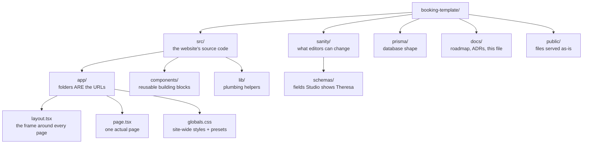
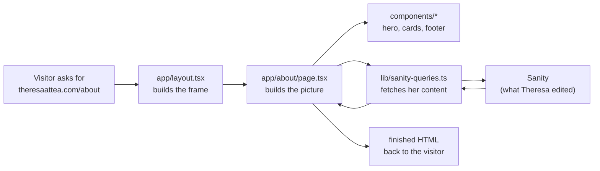

# Repo tour: what every folder is for, in plain language

Written for Joaquim. The goal: you can open this repo, know where you are, and explain it to a client without breaking a sweat. Diagrams are sized for screenshots, so you can occlude labels in Anki and quiz yourself.

## The one-sentence version

`src/` is the website's source code, `sanity/` describes what Theresa can edit, `prisma/` describes the database, `docs/` is our paper trail, and everything else at the root is configuration that tells the tools how to behave.

## The map

## Folder by folder

**`src/`** is short for source. Everything the website IS lives here. If the repo were a restaurant, `src/` is the kitchen; everything else is paperwork, suppliers, and the sign out front.

**`src/app/` is the part worth memorizing.** Next.js uses the App Router convention: the folder structure IS the site's URL structure. `app/about/page.tsx` renders at `/about`. `app/services/[slug]/page.tsx` renders at `/services/anything`, where `[slug]` means "fill in the blank from the data." Make a folder, drop a `page.tsx` in it, and you have invented a page. No registration, no config. The folders are the sitemap.

**`layout.tsx` vs `page.tsx`, the distinction that unlocks the rest:** `layout.tsx` is the picture frame: header, footer, fonts, the `<html>` tag itself. It renders around EVERY page and never re-renders when you navigate. `page.tsx` is the picture inside the frame, one per URL. When you click from Home to About, the frame stays put and only the picture swaps. That is why the header never flickers.

Other special filenames inside `app/`: `not-found.tsx` (the branded 404), `sitemap.ts` and `robots.ts` (SEO files that generate themselves), and `globals.css` (site-wide styles, including the entire style-preset system in one delimited section).

**`src/components/`** holds the reusable building blocks: `hero.tsx`, `service-card.tsx`, `site-header.tsx`, `mobile-nav.tsx`. Pages compose these like Lego. If something appears on more than one page, it lives here, exactly once. Editing `site-header.tsx` changes the header everywhere, which is the point.

**`src/lib/`** is the plumbing: code with no visual existence. `sanity-queries.ts` (every GROQ query that fetches content), `seo.ts` (metadata and JSON-LD builders), `cache.ts` (how long pages remember fetched content before asking Sanity again). Components call lib; lib talks to the outside world.

**`sanity/schemas/`** answers "what does Theresa see in her Studio editor?" Each file defines a content type and its fields: `documents/service.ts` says a Service has a title, price, photo, and so on. Add a field here, and after a schema deploy it appears as an editable box in her Studio. This folder is the contract between code and editor: code reads what these schemas let her write.

**`prisma/`** defines the database tables (bookings live here, content does not). **`public/`** is for files served untouched at the site root. **`docs/`** is the paper trail: `ROADMAP.md` (where we are), `decisions/` (ADRs, the why behind choices), and architecture maps.

## How a page actually happens

The visitor never waits on most of this: Vercel keeps a pre-rendered copy and refreshes it quietly in the background (that is the ISR caching `lib/cache.ts` controls).

## Self-test (cover the right column)

| Question | Answer |
|---|---|
| Folder that maps 1:1 to URLs | `src/app/` |
| The frame vs the picture | `layout.tsx` vs `page.tsx` |
| Where a reusable card component lives | `src/components/` |
| Where GROQ queries live | `src/lib/sanity-queries.ts` |
| What `sanity/schemas/` controls | the fields Theresa's Studio shows |
| Where the style presets live | one delimited section of `app/globals.css` |
| Where bookings are defined | `prisma/` (database), never Sanity |
